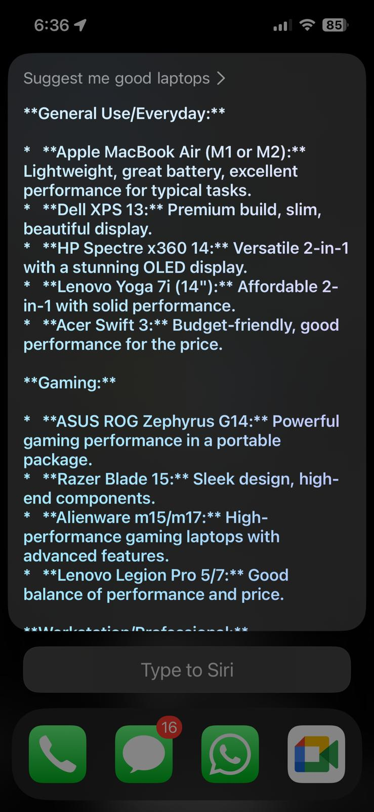

## Apple_Shortcuts_AI: Voice-Powered AI for Every iPhone with Siri & Gemini
🚀 Unlock AI Power on Any iPhone, Hands-Free!
Are you excited about AI-powered assistants but feel left out because your iPhone isn't the latest model with Apple Intelligence? This simple yet powerful Apple Shortcut changes that!

Apple_Shortcuts_AI is a REST API-based Apple Shortcut that lets you access advanced Large Language Models (LLMs) like Google Gemini directly through Siri, regardless of your iPhone model. No need for an iPhone 15 Pro or newer – if your phone runs Shortcuts and Siri, you're in!

This project effectively bridges the gap, allowing you to converse with an LLM using your voice, turning almost any iPhone into a smart AI companion.
---

**✨ Features
Universal Compatibility: Works on any iPhone, iPad, iWatch, or Mac that supports Apple Shortcuts.
Voice-Activated AI: Interact with Gemini using "Hey Siri" and your custom trigger phrase("Be Smart" now).
Seamless Gemini Integration: Leverages the Gemini REST API for powerful AI responses.
Hands-Free Interaction: Get instant answers, summaries, creative content, and more, all by speaking.
Simple Setup: Quick configuration to get your AI assistant up and running.
---

** Response to the same question from Siri vs Siri-Gemini

  
  

---

**🛠️ How It Works
This Shortcut acts as a clever intermediary:

- You activate the Shortcut via Siri (e.g., "Hey Siri, Be Smart").
- Your voice input is captured by the Shortcut.
- The Shortcut constructs an HTTP POST request containing your spoken query.
- This request is sent to the Google Gemini API endpoint.
- Gemini processes your query and returns a JSON response.
- The Shortcut parses this JSON, extracts Gemini's answer, and can display it as text or even speak it back to you!
---

🚀 Getting Started
Follow these steps to set up your voice-activated AI:

Prerequisites:
- An Apple device (iPhone, iPad, or Mac) running the Shortcuts app.
- An active internet connection.
- A Google Gemini API Key. You can obtain one for free from [Google AI Studio](https://ai.google.dev/gemini-api/docs/api-key). and have it ready to key in on your first time use 
- Installation & Setup
- Download the Shortcut: Click here for [Shortcut file](https://www.icloud.com/shortcuts/3f872467ab514defb5b3ac75f8a28e1a)
- Open the .shortcut file on your Apple device. It will automatically open in the Shortcuts app.
- Tap "Add Shortcut" to add it to your library.
- All 
- Configure Your Gemini API Key (Crucial!):
- **NEVER share your API Key publicly or commit it directly to GitHub!
- When you trigger the shortcut for the first time, it asks you to insert the API Key. Insert the key that you obtained from Gemini.
  

  
  

---

💡 Usage
- Simply say "Hey Siri, [Your Shortcut Name/Phrase]" (e.g., "Hey Siri, Be Smart").
- Siri will prompt you for your input.
- Speak your query or prompt for Gemini.
- Wait a moment, and Gemini's response will appear on your screen and/or be spoken by Siri.

---

Future Scope
The following enhancements are envisioned for the application's future development:
- Continuous Conversational Context: With further fine-tuning and optimization, the application can be scaled to support a more robust and context-aware conversational experience. This involves enabling the underlying RestAPI to intelligently remember past interactions, allowing for continuous and coherent dialogues rather than single-turn responses. This would significantly improve user engagement and the natural flow of conversations.
- Support for Non-Textual Content (Multimedia Integration): Future iterations aim to expand the application's capabilities to process and respond to non-textual inputs, such as images, audio, or video. This integration of multimedia content would open up new use cases and enrich user interaction. It is important to note that this advanced functionality will likely require leveraging paid APIs or subscriptions from external service providers.

---

